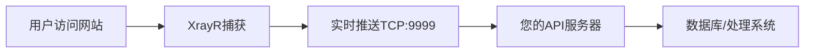

# 🚀 XrayR 实时数据API对接指南

## 📋 目录
1. [快速开始](#快速开始)
2. [配置纯实时推送模式](#配置纯实时推送模式)
3. [API对接方式](#api对接方式)
4. [部署HTTP API代理](#部署http-api代理)
5. [客户端示例](#客户端示例)
6. [数据格式说明](#数据格式说明)
7. [常见问题](#常见问题)

---

## 🎯 快速开始

### 1. 理解数据流



### 2. 三种对接方式

| 方式 | 适用场景 | 优点 | 缺点 |
|------|----------|------|------|
| **直接TCP** | 简单快速 | 低延迟，直接 | 需要处理TCP连接 |
| **HTTP API** | 标准化 | 易于集成，支持REST | 稍高延迟 |
| **WebSocket** | 实时性强 | 双向通信，实时 | 复杂度中等 |

---

## ⚙️ 配置纯实时推送模式

### 1. 修改XrayR配置

创建 `config.yml` 文件：

```yaml
# XrayR配置 - 纯实时推送模式
Nodes:
  - PanelType: "NewV2board"
    ApiConfig:
      ApiHost: "https://你的面板.com"
      ApiKey: "你的API密钥"
      NodeID: 28
      NodeType: Shadowsocks
    
    ControllerConfig:
      # 🔥 关键配置 - URL记录器
      URLLoggerConfig:
        Enable: true                    # 启用URL记录器
        LogPath: ""                     # 🔥 留空 = 不保存文件
        MaxFileSize: 0                  # 🔥 0 = 不保存文件
        MaxFileCount: 0                 # 🔥 0 = 不保存文件
        FlushInterval: 1                # 1秒立即推送
        EnableRealtime: true            # 🔥 启用实时推送
        RealtimeAddr: "0.0.0.0:9999"   # 🔥 监听所有网络接口
        EnableFullURL: true             # 记录完整URL
        ExcludeDomains:                 # 排除不需要的域名
          - "localhost"
          - "127.0.0.1"
          - "apple.com"
          - "icloud.com"

# 日志配置
LogConfig:
  Level: info
  AccessPath: ""                        # 🔥 留空 = 不保存访问日志
  ErrorPath: ""                         # 🔥 留空 = 不保存错误日志
```

### 2. 重启XrayR服务

```bash
systemctl restart xrayr
```

### 3. 验证配置

```bash
# 检查XrayR日志
journalctl -u xrayr -f

# 应该看到类似输出：
# "URL记录器运行在纯实时推送模式（不保存文件）"
# "实时推送服务器已启动，监听端口: 9999"
```

---

## 🌐 API对接方式

### 方式1: 直接TCP连接（最简单）

**优点**: 低延迟，直接获取数据
**缺点**: 需要处理TCP连接和断线重连

```python
import socket
import json

def connect_tcp():
    sock = socket.socket(socket.AF_INET, socket.SOCK_STREAM)
    sock.connect(('你的XrayR服务器IP', 9999))
    
    buffer = ""
    while True:
        data = sock.recv(4096).decode('utf-8')
        if not data:
            break
            
        buffer += data
        lines = buffer.split('\n')
        buffer = lines[-1]
        
        for line in lines[:-1]:
            if line.strip():
                try:
                    message = json.loads(line.strip())
                    if message.get('type') == 'url_access':
                        print(f"用户访问: {message['data']}")
                        # 在这里处理数据
                except json.JSONDecodeError:
                    pass

connect_tcp()
```

### 方式2: HTTP API代理（推荐）

**优点**: 标准化，易于集成，支持过滤和查询
**缺点**: 需要部署代理服务

#### 部署HTTP API代理

```bash
# 1. 下载部署脚本
curl -O https://raw.githubusercontent.com/singlinktech/sss/main/api_integration/deploy_api.sh

# 2. 一键部署
chmod +x deploy_api.sh
./deploy_api.sh

# 3. 检查服务状态
/opt/xrayr-api/manage.sh status
```

#### 使用HTTP API

```python
import requests

base_url = "http://你的服务器IP:8080"

# 获取最新记录
response = requests.get(f"{base_url}/api/records?limit=10")
data = response.json()
print(f"获取到 {data['count']} 条记录")

# 过滤特定用户
response = requests.get(f"{base_url}/api/records?user=某用户邮箱")

# 过滤特定域名
response = requests.get(f"{base_url}/api/records?domain=baidu.com")

# 获取统计信息
response = requests.get(f"{base_url}/api/stats")
stats = response.json()
print(f"总访问次数: {stats['data']['total_records']}")
```

### 方式3: WebSocket实时推送

**优点**: 双向通信，实时性强
**缺点**: 复杂度中等

```python
import websocket
import json

def on_message(ws, message):
    try:
        data = json.loads(message)
        print(f"实时数据: {data}")
        # 在这里处理数据
    except json.JSONDecodeError:
        pass

def on_error(ws, error):
    print(f"WebSocket错误: {error}")

def on_close(ws):
    print("WebSocket连接关闭")

def on_open(ws):
    print("WebSocket连接成功")

# 连接WebSocket
ws = websocket.WebSocketApp("ws://你的服务器IP:8081/ws",
                            on_message=on_message,
                            on_error=on_error,
                            on_close=on_close,
                            on_open=on_open)
ws.run_forever()
```

---

## 📊 数据格式说明

### 实时推送数据格式

```json
{
  "type": "url_access",
  "data": {
    "timestamp": "2025-01-14T12:30:45.123456789+08:00",
    "user_id": 123,
    "email": "user@example.com",
    "domain": "www.google.com",
    "full_url": "https://www.google.com:443",
    "protocol": "tls",
    "node_id": 28,
    "node_tag": "Shadowsocks_0.0.0.0_23999",
    "source_ip": "192.168.1.100",
    "user_info": "level:1,tag:vip,network:tcp",
    "request_time": "2025-01-14 12:30:45"
  }
}
```

### 字段说明

| 字段 | 类型 | 说明 |
|------|------|------|
| `timestamp` | string | 访问时间戳（ISO格式） |
| `user_id` | number | 用户ID |
| `email` | string | 用户邮箱 |
| `domain` | string | 访问的域名 |
| `full_url` | string | 完整URL（包含端口） |
| `protocol` | string | 协议类型（tls/tcp/udp） |
| `node_id` | number | 节点ID |
| `node_tag` | string | 节点标签 |
| `source_ip` | string | 用户真实IP |
| `user_info` | string | 用户额外信息 |
| `request_time` | string | 请求时间（可读格式） |

---

## 🔧 客户端示例

### 1. 存储到数据库

```python
import sqlite3
import json

class URLDataProcessor:
    def __init__(self, db_path='url_access.db'):
        self.db_path = db_path
        self.init_db()
    
    def init_db(self):
        conn = sqlite3.connect(self.db_path)
        cursor = conn.cursor()
        cursor.execute('''
            CREATE TABLE IF NOT EXISTS url_access (
                id INTEGER PRIMARY KEY AUTOINCREMENT,
                timestamp TEXT,
                user_id INTEGER,
                email TEXT,
                domain TEXT,
                full_url TEXT,
                protocol TEXT,
                node_id INTEGER,
                source_ip TEXT,
                created_at DATETIME DEFAULT CURRENT_TIMESTAMP
            )
        ''')
        conn.commit()
        conn.close()
    
    def save_record(self, data):
        conn = sqlite3.connect(self.db_path)
        cursor = conn.cursor()
        cursor.execute('''
            INSERT INTO url_access (
                timestamp, user_id, email, domain, full_url, 
                protocol, node_id, source_ip
            ) VALUES (?, ?, ?, ?, ?, ?, ?, ?)
        ''', (
            data.get('timestamp'),
            data.get('user_id'),
            data.get('email'),
            data.get('domain'),
            data.get('full_url'),
            data.get('protocol'),
            data.get('node_id'),
            data.get('source_ip')
        ))
        conn.commit()
        conn.close()
```

### 2. 发送到Webhook

```python
import requests
import json

def send_to_webhook(data):
    webhook_url = "https://your-webhook-endpoint.com/api/url-access"
    
    # 转换数据格式
    payload = {
        "event": "url_access",
        "user_id": data.get('user_id'),
        "email": data.get('email'),
        "domain": data.get('domain'),
        "url": data.get('full_url'),
        "ip": data.get('source_ip'),
        "timestamp": data.get('timestamp'),
        "node_id": data.get('node_id')
    }
    
    try:
        response = requests.post(webhook_url, json=payload, timeout=5)
        if response.status_code == 200:
            print(f"✅ 数据已发送: {data['domain']}")
        else:
            print(f"❌ 发送失败: {response.status_code}")
    except Exception as e:
        print(f"❌ 发送错误: {e}")
```

### 3. 实时监控面板

```python
import asyncio
import websockets
import json
from datetime import datetime

class RealTimeMonitor:
    def __init__(self):
        self.stats = {
            'total_requests': 0,
            'active_users': set(),
            'top_domains': {},
            'recent_activities': []
        }
    
    async def monitor(self):
        uri = "ws://你的服务器IP:8081/ws"
        
        async with websockets.connect(uri) as websocket:
            print("🔗 连接到实时监控")
            
            async for message in websocket:
                try:
                    data = json.loads(message)
                    if isinstance(data, dict) and 'user_id' in data:
                        self.process_data(data)
                except json.JSONDecodeError:
                    pass
    
    def process_data(self, data):
        # 更新统计
        self.stats['total_requests'] += 1
        self.stats['active_users'].add(data.get('user_id'))
        
        domain = data.get('domain', '')
        self.stats['top_domains'][domain] = self.stats['top_domains'].get(domain, 0) + 1
        
        # 保存最近活动
        self.stats['recent_activities'].append({
            'time': datetime.now().strftime("%H:%M:%S"),
            'user': data.get('user_id'),
            'domain': domain,
            'ip': data.get('source_ip')
        })
        
        # 只保留最近50条
        if len(self.stats['recent_activities']) > 50:
            self.stats['recent_activities'] = self.stats['recent_activities'][-50:]
        
        # 显示实时信息
        print(f"📊 总请求: {self.stats['total_requests']} | "
              f"活跃用户: {len(self.stats['active_users'])} | "
              f"用户{data.get('user_id')} 访问 {domain}")

# 运行监控
monitor = RealTimeMonitor()
asyncio.run(monitor.monitor())
```

---

## 🚀 部署生产环境

### 1. 使用Docker部署

```dockerfile
# Dockerfile
FROM python:3.9-slim

WORKDIR /app

# 安装依赖
COPY requirements.txt .
RUN pip install -r requirements.txt

# 复制代码
COPY . .

# 暴露端口
EXPOSE 8080 8081

# 启动服务
CMD ["python", "http_api_server.py"]
```

```yaml
# docker-compose.yml
version: '3.8'

services:
  xrayr-api:
    build: .
    ports:
      - "8080:8080"
      - "8081:8081"
    environment:
      - XRAYR_HOST=你的XrayR服务器IP
      - XRAYR_PORT=9999
    restart: unless-stopped
    
  redis:
    image: redis:7-alpine
    restart: unless-stopped
    
  database:
    image: postgres:14
    environment:
      POSTGRES_DB: xrayr_logs
      POSTGRES_USER: xrayr
      POSTGRES_PASSWORD: your_password
    volumes:
      - postgres_data:/var/lib/postgresql/data
    restart: unless-stopped

volumes:
  postgres_data:
```

### 2. 使用Nginx反向代理

```nginx
# /etc/nginx/sites-available/xrayr-api
server {
    listen 80;
    server_name api.yourdomain.com;
    
    location / {
        proxy_pass http://127.0.0.1:8080;
        proxy_set_header Host $host;
        proxy_set_header X-Real-IP $remote_addr;
        proxy_set_header X-Forwarded-For $proxy_add_x_forwarded_for;
        proxy_set_header X-Forwarded-Proto $scheme;
    }
    
    location /ws {
        proxy_pass http://127.0.0.1:8081;
        proxy_http_version 1.1;
        proxy_set_header Upgrade $http_upgrade;
        proxy_set_header Connection "upgrade";
        proxy_set_header Host $host;
    }
}
```

---

## ❓ 常见问题

### Q1: 为什么收不到数据？

**检查清单**:
1. ✅ XrayR是否启动并运行正常
2. ✅ `URLLoggerConfig.Enable` 是否为 `true`
3. ✅ `RealtimeAddr` 是否配置为 `0.0.0.0:9999`
4. ✅ 防火墙是否开放9999端口
5. ✅ 是否有用户在使用代理访问网站

```bash
# 检查XrayR服务状态
systemctl status xrayr

# 检查端口是否监听
netstat -tlnp | grep 9999

# 检查防火墙
ufw status
```

### Q2: 如何减少数据量？

**配置过滤**:
```yaml
URLLoggerConfig:
  ExcludeDomains:
    - "localhost"
    - "127.0.0.1"
    - "apple.com"
    - "icloud.com"
    - "microsoft.com"
    - "github.com"
  # 只记录特定域名
  IncludeDomains:
    - "google.com"
    - "facebook.com"
    - "youtube.com"
```

### Q3: 如何处理大量数据？

**优化建议**:
1. 使用Redis缓存热点数据
2. 数据分片存储
3. 异步处理数据
4. 定期清理历史数据

```python
# 异步处理示例
import asyncio
import aioredis

async def process_data_async(data):
    # 异步处理数据
    redis = await aioredis.create_redis_pool('redis://localhost')
    
    # 缓存热点数据
    await redis.hincrby('user_stats', data['user_id'], 1)
    await redis.hincrby('domain_stats', data['domain'], 1)
    
    # 异步写入数据库
    await save_to_database_async(data)
```

### Q4: 数据丢失怎么办？

**防丢失策略**:
1. 使用消息队列（RabbitMQ/Kafka）
2. 实现重试机制
3. 数据备份
4. 监控告警

```python
# 重试机制示例
import time
from functools import wraps

def retry(max_attempts=3, delay=1):
    def decorator(func):
        @wraps(func)
        def wrapper(*args, **kwargs):
            for attempt in range(max_attempts):
                try:
                    return func(*args, **kwargs)
                except Exception as e:
                    if attempt == max_attempts - 1:
                        raise e
                    time.sleep(delay)
            return None
        return wrapper
    return decorator

@retry(max_attempts=3, delay=2)
def send_to_api(data):
    # 发送数据到API
    pass
```

---

## 🎉 完成！

恭喜您！现在您已经学会了：

1. ✅ 配置XrayR纯实时推送模式
2. ✅ 使用三种不同方式对接API
3. ✅ 部署HTTP API代理服务
4. ✅ 创建各种客户端处理数据
5. ✅ 解决常见问题

**下一步建议**:
1. 🔒 配置HTTPS和安全认证
2. 📊 创建数据分析面板
3. 🚨 设置监控告警
4. 🔄 实现数据备份策略

**需要帮助?**
- 📧 问题反馈: 在GitHub Issues中提交
- 📖 更多文档: 查看项目README
- 💬 讨论交流: 加入社区群组

**记住**: 数据是您的资产，合理使用这些API能让您的业务更加智能化！🚀 