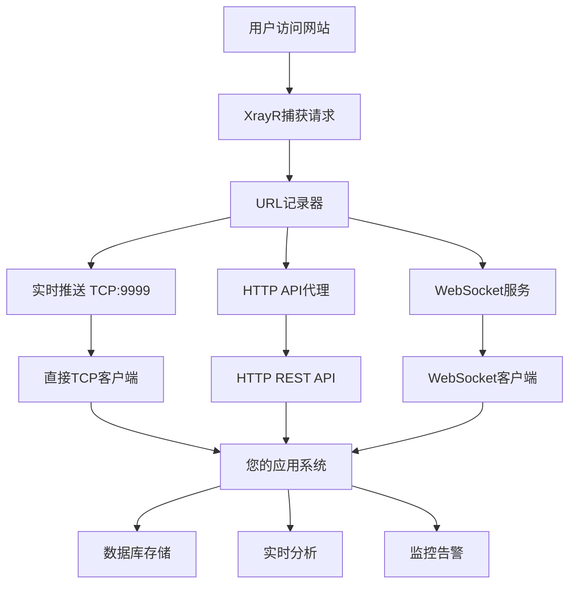

# 🚀 XrayR URL Logger - 实时数据API对接版

[](https://github.com/singlinktech/sss/releases)
[](LICENSE)
[](https://goreportcard.com/report/github.com/singlinktech/sss)

## 📋 项目简介

XrayR URL Logger 是一个增强版的 XrayR，专为需要实时监控用户访问数据的场景设计。与传统的日志文件方式不同，本项目提供了**实时API接口**，让您可以通过多种方式获取用户访问数据，避免服务器硬盘空间不足的问题。

### 🎯 核心特性

- **🔥 实时数据推送**: TCP/WebSocket/HTTP API 多种方式获取实时数据
- **💾 零文件存储**: 纯实时推送模式，不在节点服务器保存日志文件
- **🌐 多协议支持**: TCP直连、HTTP REST API、WebSocket实时推送
- **📊 数据统计**: 内置用户访问统计和域名访问排行
- **🔧 易于集成**: 提供多种编程语言的客户端示例
- **🚀 高性能**: 优化的数据传输，支持高并发访问

### 🏗️ 系统架构



## 🚀 快速开始

### 1. 安装XrayR

```bash
# 一键安装（包含URL记录器功能）
bash <(curl -L https://raw.githubusercontent.com/singlinktech/sss/main/ONE_CLICK_INSTALL.sh)
```

### 2. 配置纯实时推送模式

编辑 `/etc/xrayr/config.yml`：

```yaml
# 关键配置 - 纯实时推送模式
URLLoggerConfig:
  Enable: true                    # 启用URL记录器
  LogPath: ""                     # 🔥 留空 = 不保存文件
  MaxFileSize: 0                  # 🔥 0 = 不保存文件
  MaxFileCount: 0                 # 🔥 0 = 不保存文件
  EnableRealtime: true            # 🔥 启用实时推送
  RealtimeAddr: "0.0.0.0:9999"   # 🔥 监听所有网络接口
  EnableFullURL: true             # 记录完整URL
```

### 3. 快速测试

```bash
# 下载并运行快速测试
curl -O https://raw.githubusercontent.com/singlinktech/sss/main/api_integration/quick_start.sh
chmod +x quick_start.sh
./quick_start.sh
```

## 🌐 API对接方式

### 方式1: 直接TCP连接（推荐用于高性能场景）

```python
import socket
import json

def connect_tcp():
    sock = socket.socket(socket.AF_INET, socket.SOCK_STREAM)
    sock.connect(('你的XrayR服务器IP', 9999))
    
    buffer = ""
    while True:
        data = sock.recv(4096).decode('utf-8')
        buffer += data
        lines = buffer.split('\n')
        buffer = lines[-1]
        
        for line in lines[:-1]:
            if line.strip():
                try:
                    message = json.loads(line.strip())
                    if message.get('type') == 'url_access':
                        print(f"用户访问: {message['data']}")
                        # 在这里处理数据
                except json.JSONDecodeError:
                    pass

connect_tcp()
```

### 方式2: HTTP REST API（推荐用于标准化集成）

```bash
# 1. 部署HTTP API代理
curl -O https://raw.githubusercontent.com/singlinktech/sss/main/api_integration/deploy_api.sh
chmod +x deploy_api.sh
./deploy_api.sh

# 2. 使用API
curl "http://你的服务器:8080/api/records?limit=10"
curl "http://你的服务器:8080/api/stats"
```

### 方式3: WebSocket实时推送（推荐用于实时监控）

```python
import websocket
import json

def on_message(ws, message):
    data = json.loads(message)
    print(f"实时数据: {data}")
    # 处理数据

ws = websocket.WebSocketApp("ws://你的服务器:8081/ws",
                            on_message=on_message)
ws.run_forever()
```

## 📊 数据格式

### 实时推送数据结构

```json
{
  "type": "url_access",
  "data": {
    "timestamp": "2025-01-14T12:30:45.123456789+08:00",
    "user_id": 123,
    "email": "user@example.com",
    "domain": "www.google.com",
    "full_url": "https://www.google.com:443",
    "protocol": "tls",
    "node_id": 28,
    "node_tag": "Shadowsocks_0.0.0.0_23999",
    "source_ip": "192.168.1.100",
    "user_info": "level:1,tag:vip,network:tcp",
    "request_time": "2025-01-14 12:30:45"
  }
}
```

## 🔧 客户端示例

### Python客户端

```python
# 存储到数据库
import sqlite3
import json

class URLDataProcessor:
    def __init__(self):
        self.init_db()
    
    def init_db(self):
        conn = sqlite3.connect('url_access.db')
        cursor = conn.cursor()
        cursor.execute('''
            CREATE TABLE IF NOT EXISTS url_access (
                id INTEGER PRIMARY KEY AUTOINCREMENT,
                timestamp TEXT,
                user_id INTEGER,
                email TEXT,
                domain TEXT,
                full_url TEXT,
                protocol TEXT,
                node_id INTEGER,
                source_ip TEXT,
                created_at DATETIME DEFAULT CURRENT_TIMESTAMP
            )
        ''')
        conn.commit()
        conn.close()
    
    def save_record(self, data):
        conn = sqlite3.connect('url_access.db')
        cursor = conn.cursor()
        cursor.execute('''
            INSERT INTO url_access (
                timestamp, user_id, email, domain, full_url, 
                protocol, node_id, source_ip
            ) VALUES (?, ?, ?, ?, ?, ?, ?, ?)
        ''', (
            data.get('timestamp'),
            data.get('user_id'),
            data.get('email'),
            data.get('domain'),
            data.get('full_url'),
            data.get('protocol'),
            data.get('node_id'),
            data.get('source_ip')
        ))
        conn.commit()
        conn.close()
```

### JavaScript客户端

```javascript
// WebSocket客户端
const WebSocket = require('ws');

const ws = new WebSocket('ws://你的服务器:8081/ws');

ws.on('message', function message(data) {
    try {
        const record = JSON.parse(data);
        console.log('收到数据:', record);
        
        // 处理数据
        if (record.type === 'url_access') {
            // 保存到数据库或发送到其他服务
            processUrlAccess(record.data);
        }
    } catch (error) {
        console.error('解析JSON失败:', error);
    }
});

function processUrlAccess(data) {
    // 您的业务逻辑
    console.log(`用户 ${data.user_id} 访问了 ${data.domain}`);
}
```

### Go客户端

```go
package main

import (
    "bufio"
    "encoding/json"
    "fmt"
    "net"
    "strings"
)

type URLAccessData struct {
    Type string `json:"type"`
    Data struct {
        Timestamp string `json:"timestamp"`
        UserID    int    `json:"user_id"`
        Email     string `json:"email"`
        Domain    string `json:"domain"`
        FullURL   string `json:"full_url"`
        Protocol  string `json:"protocol"`
        NodeID    int    `json:"node_id"`
        SourceIP  string `json:"source_ip"`
    } `json:"data"`
}

func main() {
    conn, err := net.Dial("tcp", "你的服务器:9999")
    if err != nil {
        panic(err)
    }
    defer conn.Close()

    scanner := bufio.NewScanner(conn)
    
    for scanner.Scan() {
        line := strings.TrimSpace(scanner.Text())
        if line == "" {
            continue
        }
        
        var record URLAccessData
        if err := json.Unmarshal([]byte(line), &record); err != nil {
            continue
        }
        
        if record.Type == "url_access" {
            fmt.Printf("用户 %d 访问了 %s\n", 
                record.Data.UserID, record.Data.Domain)
            // 处理数据
        }
    }
}
```

## 📁 项目结构

```
XrayR-master/
├── api_integration/           # API对接工具
│   ├── http_api_server.py    # HTTP API代理服务器
│   ├── client_examples.py    # 客户端示例
│   ├── deploy_api.sh         # 一键部署脚本
│   ├── quick_start.sh        # 快速测试脚本
│   └── requirements.txt      # Python依赖
├── config_examples/          # 配置示例
│   └── realtime_only_config.yml
├── common/urllogger/         # URL记录器核心代码
├── app/mydispatcher/         # 数据分发器
├── API_INTEGRATION_GUIDE.md  # 详细对接指南
├── REALTIME_API_DOCS.md      # API文档
└── README.md                 # 本文件
```

## 🔧 部署选项

### 开发环境

```bash
# 1. 克隆项目
git clone https://github.com/singlinktech/sss.git
cd sss

# 2. 快速测试
./api_integration/quick_start.sh

# 3. 运行客户端示例
python3 api_integration/client_examples.py
```

### 生产环境

```bash
# 1. 部署HTTP API代理
./api_integration/deploy_api.sh

# 2. 配置Nginx反向代理
# 请参考 API_INTEGRATION_GUIDE.md

# 3. 设置监控告警
# 请参考生产环境部署文档
```

### Docker部署

```bash
# 使用Docker Compose
docker-compose up -d
```

## 📖 文档索引

- 📘 **[API对接指南](API_INTEGRATION_GUIDE.md)** - 详细的API对接教程
- 📗 **[实时API文档](REALTIME_API_DOCS.md)** - 完整的API接口文档
- 📙 **[快速使用指南](QUICK_USE_GUIDE.md)** - 快速上手指南
- 📕 **[部署指南](EASY_DEPLOYMENT_STEPS.md)** - 详细部署步骤

## 🤝 应用场景

### 1. 用户行为分析
- 实时监控用户访问模式
- 识别异常访问行为
- 生成用户画像数据

### 2. 安全监控
- 检测恶意域名访问
- 监控大流量用户
- 实时安全告警

### 3. 运营分析
- 流量统计和分析
- 用户活跃度监控
- 节点性能评估

### 4. 合规审计
- 访问日志审计
- 用户行为追踪
- 数据合规检查

## ❓ 常见问题

### Q: 为什么收不到数据？
A: 请检查：
1. XrayR服务是否正常运行
2. URLLoggerConfig.Enable 是否为 true
3. RealtimeAddr 是否配置正确
4. 防火墙是否开放9999端口

### Q: 如何减少数据量？
A: 在配置中添加 ExcludeDomains 来过滤不需要的域名。

### Q: 数据会丢失吗？
A: 建议使用消息队列和重试机制来确保数据可靠性。

### Q: 性能如何？
A: 经过优化，支持高并发访问，内存使用控制在合理范围内。

## 🛠️ 技术栈

- **后端**: Go 1.21+
- **数据传输**: TCP/WebSocket/HTTP
- **API服务**: Python Flask
- **数据库**: SQLite/PostgreSQL/MySQL
- **缓存**: Redis (可选)
- **监控**: Prometheus/Grafana (可选)

## 📊 性能指标

- **延迟**: < 100ms (TCP直连)
- **吞吐量**: > 10000 records/second
- **内存使用**: < 100MB (纯实时模式)
- **CPU使用**: < 5% (正常负载)

## 🤝 贡献指南

欢迎贡献代码！请遵循以下步骤：

1. Fork 本项目
2. 创建特性分支 (`git checkout -b feature/AmazingFeature`)
3. 提交更改 (`git commit -m 'Add some AmazingFeature'`)
4. 推送到分支 (`git push origin feature/AmazingFeature`)
5. 创建 Pull Request

## 📞 技术支持

- 📧 **问题反馈**: [GitHub Issues](https://github.com/singlinktech/sss/issues)
- 📖 **文档说明**: [Wiki](https://github.com/singlinktech/sss/wiki)
- 💬 **社区讨论**: [Discussions](https://github.com/singlinktech/sss/discussions)

## 📄 许可证

本项目使用 MIT 许可证。详见 [LICENSE](LICENSE) 文件。

## 🙏 致谢

感谢以下项目的贡献：
- [XrayR](https://github.com/XrayR-project/XrayR) - 原始项目
- [V2Ray](https://github.com/v2ray/v2ray-core) - 核心代理功能
- [Xray](https://github.com/XTLS/Xray-core) - 高性能代理内核

---

<div align="center">
  <h3>🚀 让数据驱动您的业务决策！</h3>
  <p>如果这个项目对您有帮助，请给我们一个 ⭐ Star！</p>
</div>
